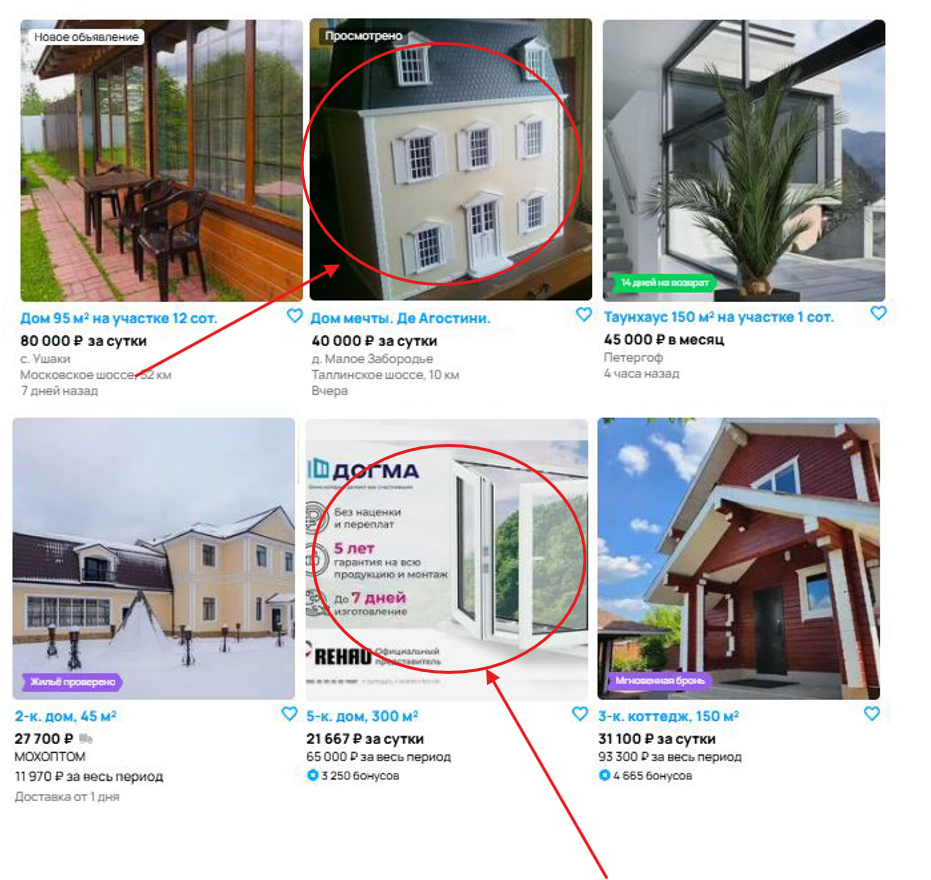

## Отчет о багах на странице Авито

### Критические баги (High)

**1. [Некорректная геолокация]**  
**Описание:** При выборе региона "Москва и МО" система некорректно отображает предложения и карту Санкт-Петербурга.
**Приоритет:** High  
**Обоснование:** Блокирует основной функционал поиска по местоположению. Пользователь может случайно арендовать жилье в неправильном городе.  

**2. [Нарушение фильтрации по цене]**  
**Описание:** Система показывает предложения дороже установленного лимита (50 000 руб).  
**Приоритет:** High  
**Обоснование:** Критическая ошибка фильтрации, ведущая к финансовым рискам для пользователей.  

**3. [Нарушение сортировки по дате]**  
**Описание:** В топе результатов отображаются устаревшие объявления (2016 год) при сортировке по дате загрузки.  
**Приоритет:** High  
**Обоснование:** Ломает ключевую функцию сортировки, пользователи пропускают актуальные предложения.  

**4. [Некорректный расчет стоимости]**  
**Описание:** Цена за сутки превышает стоимость за более длительный период.  
**Приоритет:** High  
**Обоснование:** Парадоксальная логика ценообразования вводит в заблуждение и влияет на решение о покупке.  

### Средние баги (Medium)

**5. [Несоответствие фильтра "Посуточно"]**  
**Описание:** В разделе "Посуточно" присутствуют предложения с месячной арендой.  
**Приоритет:** Medium  
**Обоснование:** Нарушает ожидания пользователей, но не блокирует полностью работу сервиса.  

**6. [Нерелевантные объявления]**  
**Описание:** В категории "Аренда жилья" найдены:  
- Аренда игрушечного дома  
- Услуги демонтажа окон  
**Приоритет:** Medium  
**Обоснование:** Снижает доверие к системе, но не влияет на основной функционал.  
  

**7. [Ложное уведомление "Ничего не найдено"]**  
**Описание:** Сообщение появляется при наличии подходящих объявлений.  
**Приоритет:** Medium  
**Обоснование:** Дезориентирует пользователей, но не препятствует просмотру результатов.  

**8. [Несоответствие заголовка раздела]**  
**Описание:** При фильтре "Посуточно" отображается заголовок "На длительный срок".  
**Приоритет:** Medium  
**Обоснование:** Противоречивый UI, но не влияет на функциональность.  

**9. [Ошибка состояния кнопки "Открытая карта"]**  
**Описание:** Кнопка активна, но карта свернута.  
**Приоритет:** Medium  
**Обоснование:** Нарушает принцип визуальной согласованности интерфейса.  

**10. [Некорректная пагинация]**  
**Описание:** Отображение 4 страниц при 6 объявлениях.  
**Приоритет:** Medium  
**Обоснование:** Вводит в заблуждение, но не блокирует навигацию.  

### Незначительные баги (Low)

**11. [Орфографические ошибки]**  
**Описание:**  
- "НайтИ" вместо "Найти" в кнопке  
- "коко-место" вместо "койко-место" в футере  
**Приоритет:** Low  
**Обоснование:** Не влияют на функционал, но портят впечатление о качестве продукта.  
  

**12. [Некорректный параметр "Доставка"]**  
**Описание:** В карточке аренды указана "доставка от 1 дня", что не имеет логического смысла для данной категории (услуги аренды).  
**Приоритет:** Low  
**Обоснование:** Логическая ошибка, но не препятствует аренде.  
 
