## Отчет о багах на странице Авито

---

**1. [Несоответствие геолокации отображаемых объявлений от геолокации, выбранной в фильтре]**  
**Описание:** При выборе региона "Москва и МО" система некорректно отображает предложения из Санкт-Петербурга и Лен. области.   
**Приоритет:** High  
**Обоснование:** Блокирует основной функционал поиска по местоположению. Пользователь может случайно арендовать жилье в неправильном городе.  
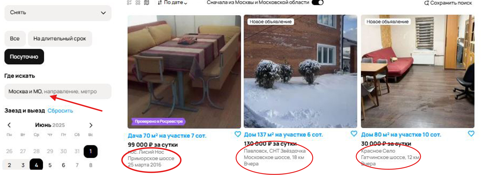

---

**2. [Некорректное отображение геолокации на карте при выбранном фильтре с другой геолокацией]**  
**Описание:** При выборе региона "Москва и МО" система некорректно отображает карту Санкт-Петербурга. Может быть связано с некорректным отображением объявлений (тоже из СПб)  
**Приоритет:** High  
**Обоснование:** Блокирует основной функционал поиска по местоположению. Пользователь может случайно арендовать жилье в неправильном городе.  
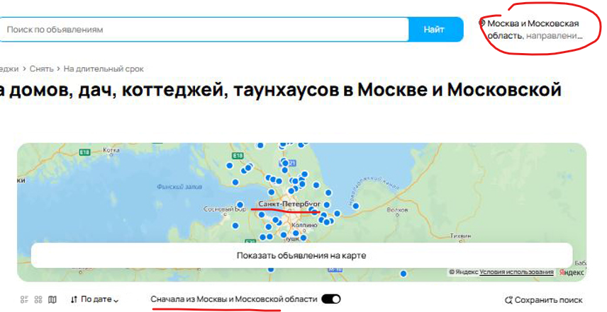

---

**3. [Несоответствие объявлений при выборе фильтра "Посуточно"]**  
**Описание:** В разделе "Посуточно" присутствуют предложения со стоимостью съема за месяц.   
**Приоритет:** Medium   
**Обоснование:** Нарушает ожидания пользователей, но не блокирует полностью работу сервиса.  
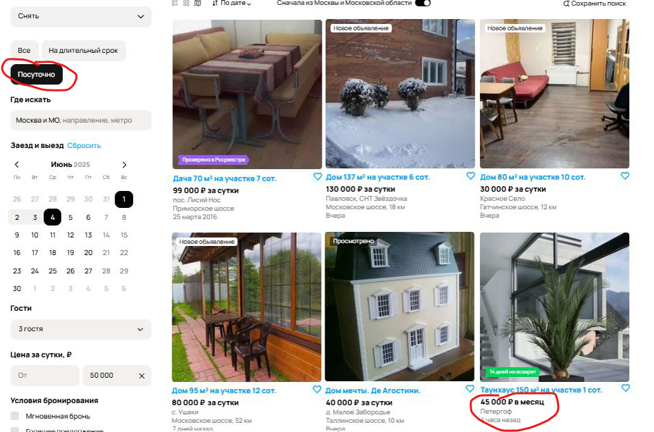

---

**4. [Орфографическая ошибкка в кнопке "Найти"]**  
**Описание:**  "НайтИ" вместо "Найти" в кнопке в поисковой строке объявлений сверху.  
**Приоритет:** Low  
**Обоснование:** Не влияют на функционал, но портят впечатление о качестве продукта.  
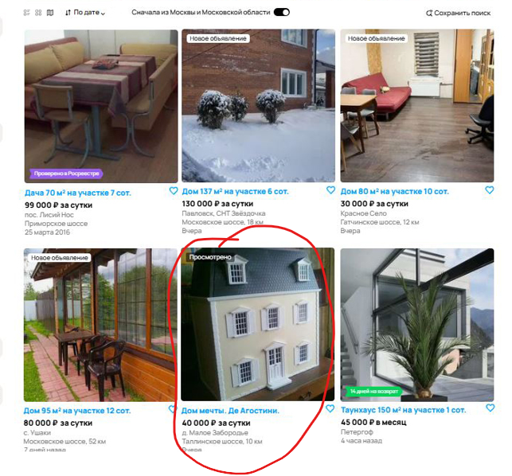  

---

**5. [Нарушение фильтрации по цене при установленном фильтре Цены за сутки "До"]**  
**Описание:** Система показывает предложения дороже установленного лимита (50 000 руб) в фильтре "Цена за сутки".  
**Приоритет:** High  
**Обоснование:** Критическая ошибка фильтрации, ведущая к финансовым рискам для пользователей.  
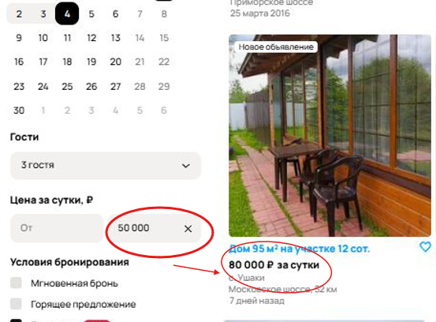

---

**6. [Ложное уведомление "Ничего не найдено" при наличии предложений]**  
**Описание:** Система отображает сообщение "Ничего не найдено в выбранной области поиска", хотя на странице присутствуют карточки объявлений. Это создает противоречивую ситуацию.  
**Приоритет:** Medium  
**Обоснование:** Дезориентирует пользователей, но не препятствует просмотру результатов.  

---

**7. [Нарушение сортировки объявлений по дате]**  
**Описание:** В топе результатов отображаются устаревшие объявления (2016 год) при сортировке по дате загрузки.  
**Приоритет:** High  
**Обоснование:** Ломает ключевую функцию сортировки, пользователи пропускают актуальные предложения.  

---

**8. [Орфографическая ошибкка в футере]**  
**Описание:**  "коко-место" вместо "койко-место" в футере в разделе "Путешествия".  
**Приоритет:** Low  
**Обоснование:** Не влияют на функционал, но портят впечатление о качестве продукта.  

---

**9. [Некорректный параметр "Доставка" у объявления о съеме жилья]**  
**Описание:** В карточке аренды указана "доставка от 1 дня", что не имеет логического смысла для категории съема жилья.  
**Приоритет:** Medium  
**Обоснование:** Логическая ошибка  
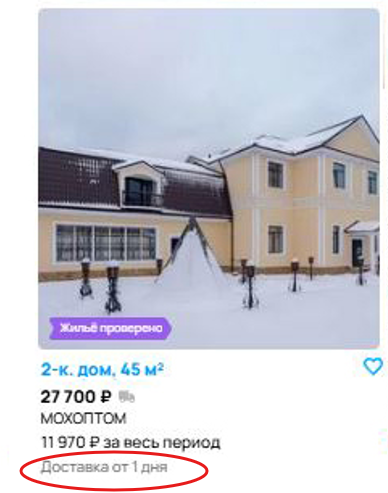 

---

**10. [Несоответствие заголовка раздела с указанным фильтром]**  
**Описание:** При фильтре "Посуточно" отображается заголовок наверху страницы "На длительный срок".  
**Приоритет:** Medium  
**Обоснование:** Противоречивый UI, но не влияет на функциональность.  
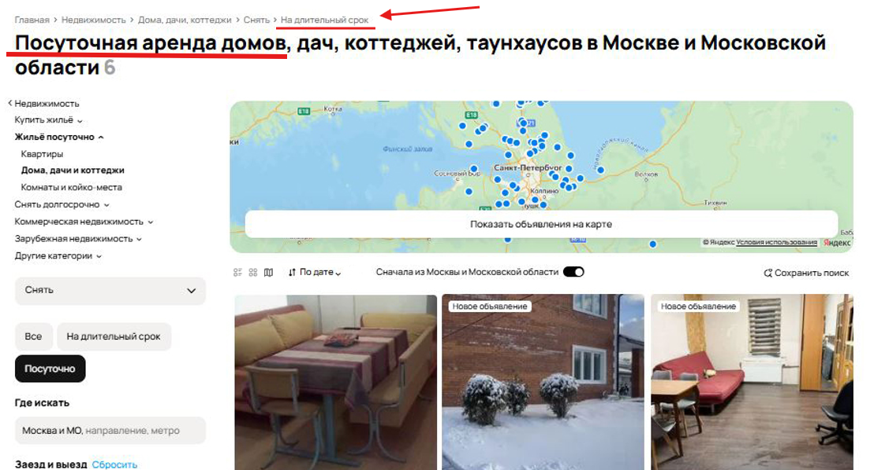

---

**11. [Ошибка состояния кнопки "Открытая карта" при другом фактическом отображении карты]**  
**Описание:** Несоответствие состояния кнопки "Открытая карта" фактическому отображению карты (свёрнута при активном состоянии кнопки).  
**Приоритет:** Medium  
**Обоснование:** Нарушает принцип визуальной согласованности интерфейса.  
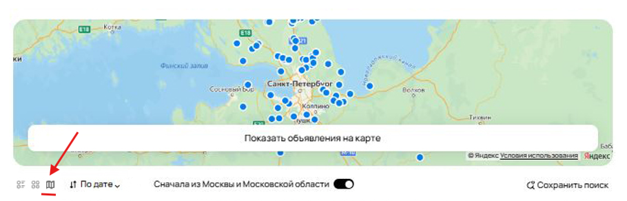

---

**12. [Неотображение итоговой стоимости у некоторых объявлений]**  
**Описание:** Система не рассчитывает/не отображает итоговую стоимость аренды за весь период для каждого предложения, хотя данные о цене и длительности доступны.  
**Приоритет:** Medium  
**Обоснование:** вынуждает пользователя проводить расчеты вручную.  

---

**13. [Некорректный расчет стоимости за весь период у некоторых объявлений]**  
**Описание:** Цена за весь период не соответствует корректному подсчету по стоимости за сутки * кол-во дней.  
**Приоритет:** High  
**Обоснование:** Парадоксальная логика ценообразования вводит в заблуждение и влияет на решение о покупке.  
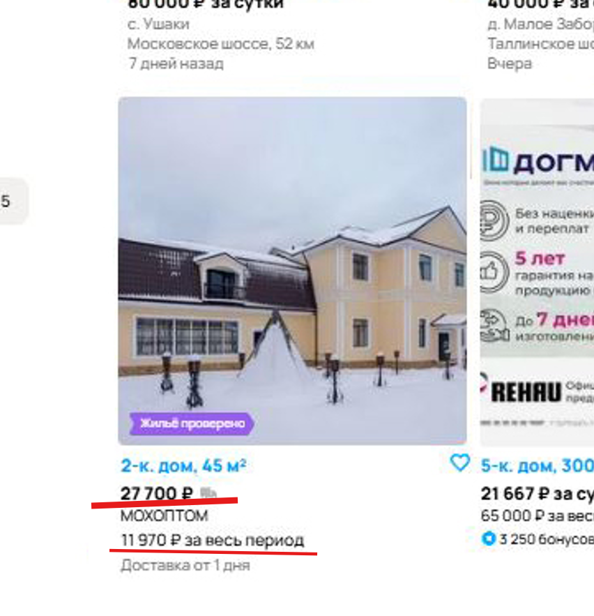

---

**14. [Некорректная пагинация при маленьком количестве объявлений]**  
**Описание:** Отображение 4 страниц пагинации при 6 объявлениях в сумме.  
**Приоритет:** Medium  
**Обоснование:** Вводит в заблуждение, но не блокирует навигацию.  

---

**15. [Нерелевантное объявление в разделе Съема жилья]**  
**Описание:** В категории "Аренда жилья" найдено объявление аренды игрушечного дома    
**Приоритет:** Medium  
**Обоснование:** Снижает доверие к системе, но не влияет на основной функционал.  

**16. [Нерелевантное объявление в разделе Съема жилья]**  
**Описание:** В категории "Аренда жилья" найдено объявление услуги демонтажа окон (на изображении)    
**Приоритет:** Medium  
**Обоснование:** Снижает доверие к системе, но не влияет на основной функционал.  
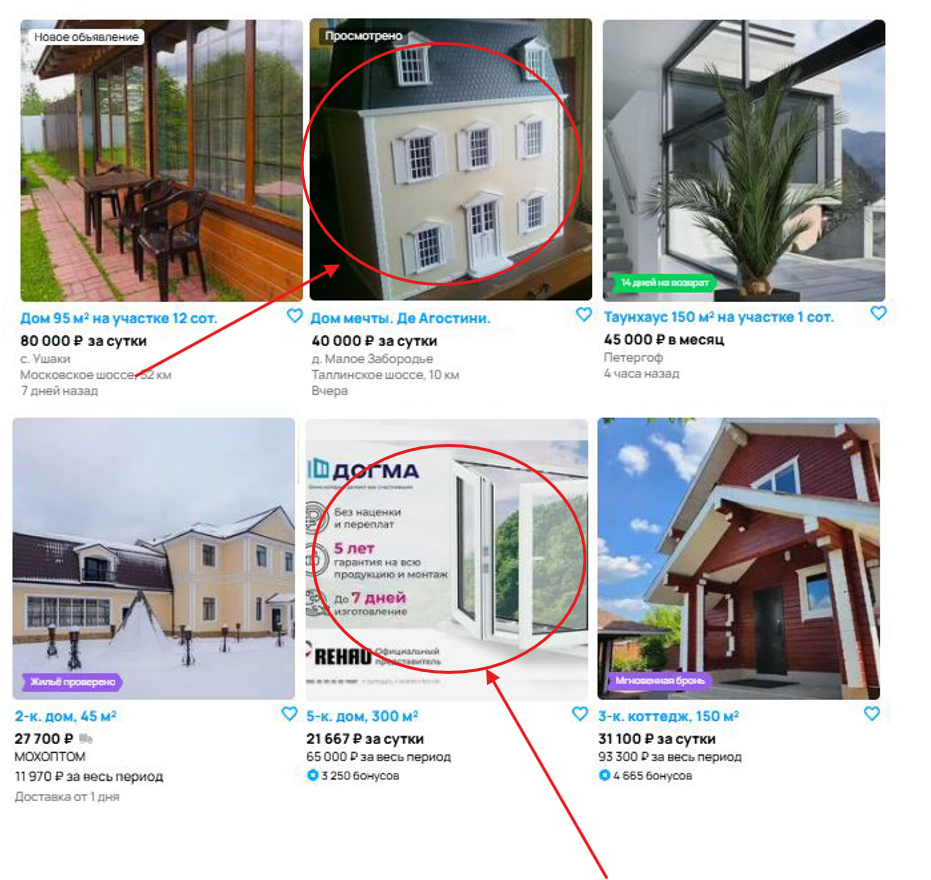

---

**17. [Некорректный подсчет количества объявлений сверху страницы]**  
**Описание:** Система отображает сообщение сверху страницы о 6 найденных объявлениях, при этом фактически на странице присутствует 9 карточек.  
**Приоритет:** High  
**Обоснование:** Критическая ошибка в отображении данных.  

---

**18. [Орфографическая ошибкка на левой панели]**  
**Описание:**  "Да" вместо "До" на левой панели в фильтре "Площадь участка" От и До.  
**Приоритет:** Low  
**Обоснование:** Не влияют на функционал, но портят впечатление о качестве продукта.  
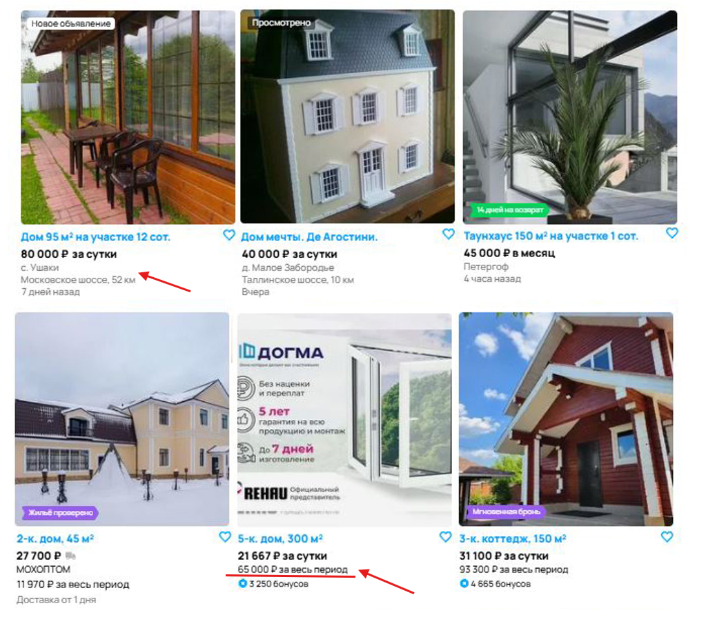

---

---

