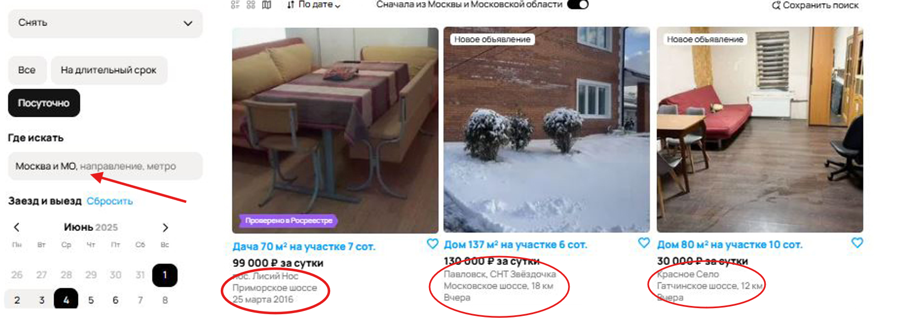
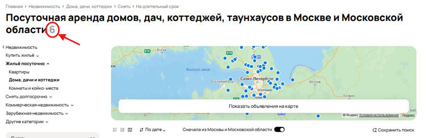

## Отчет о багах на странице Авито

---
### Критические баги (High)

**1. [Некорректная геолокация]**  
**Описание:** При выборе региона "Москва и МО" система некорректно отображает предложения и карту Санкт-Петербурга.   
**Приоритет:** High  
**Обоснование:** Блокирует основной функционал поиска по местоположению. Пользователь может случайно арендовать жилье в неправильном городе.  

**2. [Нарушение фильтрации по цене]**  
**Описание:** Система показывает предложения дороже установленного лимита (50 000 руб).  
**Приоритет:** High  
**Обоснование:** Критическая ошибка фильтрации, ведущая к финансовым рискам для пользователей.  

**3. [Нарушение сортировки по дате]**  
**Описание:** В топе результатов отображаются устаревшие объявления (2016 год) при сортировке по дате загрузки.  
**Приоритет:** High  
**Обоснование:** Ломает ключевую функцию сортировки, пользователи пропускают актуальные предложения.  

**4. [Некорректный расчет стоимости]**  
**Описание:** Цена за весь период не соответствует корректному подсчету по стоимости за сутки * кол-во дней.  
**Приоритет:** High  
**Обоснование:** Парадоксальная логика ценообразования вводит в заблуждение и влияет на решение о покупке.  

**4.2. [Неполный расчет стоимости]**  
**Описание:** Система не рассчитывает/не отображает итоговую стоимость аренды за весь период для каждого предложения, хотя данные о цене и длительности доступны.  
**Приоритет:** Medium  
**Обоснование:** вынуждает пользователя проводить расчеты вручную.

**5. [Некорректный подсчет количества объявлений]**  
**Описание:** Система отображает сообщение о 6 найденных объявлениях, при этом фактически на странице присутствует 9 карточек.  
**Приоритет:** High  
**Обоснование:** Критическая ошибка в отображении данных.

---

### Средние баги (Medium)

**6. [Несоответствие фильтра "Посуточно"]**  
**Описание:** В разделе "Посуточно" присутствуют предложения с месячной арендой.  
**Приоритет:** Medium  
**Обоснование:** Нарушает ожидания пользователей, но не блокирует полностью работу сервиса.  

**7. [Нерелевантные объявления]**  
**Описание:** В категории "Аренда жилья" найдены:  
- Аренда игрушечного дома  
- Услуги демонтажа окон (на изображении)  
**Приоритет:** Medium  
**Обоснование:** Снижает доверие к системе, но не влияет на основной функционал.  

**8. [Ложное уведомление "Ничего не найдено"]**  
**Описание:** Система отображает сообщение "Ничего не найдено в выбранной области поиска", хотя на странице присутствуют карточки объявлений. Это создает противоречивую ситуацию.  
**Приоритет:** Medium  
**Обоснование:** Дезориентирует пользователей, но не препятствует просмотру результатов.  

**9. [Несоответствие заголовка раздела]**  
**Описание:** При фильтре "Посуточно" отображается заголовок "На длительный срок".  
**Приоритет:** Medium  
**Обоснование:** Противоречивый UI, но не влияет на функциональность.  

**10. [Ошибка состояния кнопки "Открытая карта"]**  
**Описание:** Несоответствие состояния кнопки "Открытая карта" фактическому отображению карты (свёрнута при активном состоянии кнопки).  
**Приоритет:** Medium  
**Обоснование:** Нарушает принцип визуальной согласованности интерфейса.  

**11. [Некорректная пагинация]**  
**Описание:** Отображение 4 страниц при 6 объявлениях.  
**Приоритет:** Medium  
**Обоснование:** Вводит в заблуждение, но не блокирует навигацию.  

---

### Незначительные баги (Low)

**12. [Орфографические ошибки]**  
**Описание:**  
- "НайтИ" вместо "Найти" в кнопке  
- "коко-место" вместо "койко-место" в футере  
- "Да" вместо "До" в размере Площади участка  
**Приоритет:** Low  
**Обоснование:** Не влияют на функционал, но портят впечатление о качестве продукта.  
  

**13. [Некорректный параметр "Доставка"]**  
**Описание:** В карточке аренды указана "доставка от 1 дня", что не имеет логического смысла для данной категории (услуги аренды).  
**Приоритет:** Low  
**Обоснование:** Логическая ошибка, но не препятствует аренде.  
 
